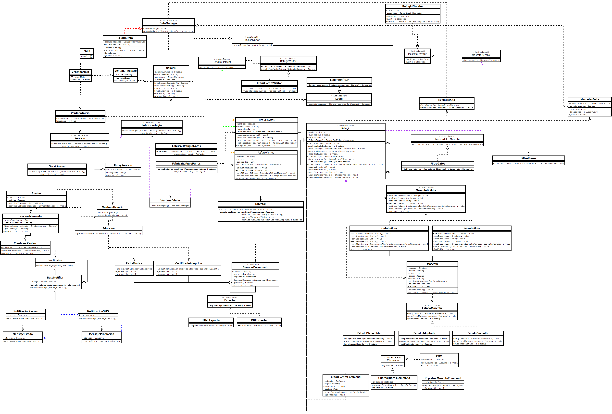

# 🐈 Adopción de Mascotas 🐶

## Integrantes: 
* Juan Esteban Cañón Solorza 🍖
* David Felipe Gil Laverde 🍙
* Juan Sebastian Diaz Peña 🍡

## UML 🗺️📍: 

## Documento de Ingeniería de Requerimientos 🤖:
* __Link:__ https://docs.google.com/document/d/1kqV0Sha7xM_rCWYgfTJag6TEKZqSLzAMU3SfKLHwtrA/edit?usp=sharing

## Mapa de Usuario 🧐:
* https://trello.com/invite/b/68f7acf52211b685fdf948f0/ATTI3075b61e4319142eb530dbc88f89a4a368B0D55C/proyectofinalmodelos

>[!CAUTION]
> El trello se puede modificar, entonces tener cuidado XD

## Patrones Usados:
* ### Creacionales:
__Factory Method 🏭:__ Ayuda a crear los refugios de cada animal 
__Singleton 👾:__ Manejo de acceso a los archivos ".data" 
__Builder 👷:__ Creación de mascotas con diferentes características 
 

* ### Estructurales:
__Proxy 🔒:__ Contralo el acceso de los usuarios y admins 
__Facade 🧱:__ Generación de documentos de la mascota a la hora de la adopción 
__Bridge 🌉:__ Exportación de documentos de la mascota a HTML y PDF 
__Decorator🎄:__ Determina el tipo de mensaje y el canal por donde se enviará 

## Enunciado del ejercicio 📖: 
El proyecto consiste en desarrollar una aplicación para facilitar la adopción de mascotas, conectando refugios de animales con personas interesadas en adoptar. La plataforma tiene como objetivo simplificar el proceso de adopción, garantizar el bienestar de las mascotas y proporcionar herramientas para un seguimiento adecuado de su estado después de ser adoptadas.

Cada mascota disponible para adopción contará con un perfil detallado que incluirá información básica como nombre, especie, raza, edad, sexo y tamaño, además de fotografías y una descripción de su carácter y necesidades específicas. Adicionalmente, se deberá incluir el carnet de vacunación digital de la mascota, que registrará las vacunas aplicadas, desparasitaciones, tratamientos médicos y próximas fechas de vacunación. También se registrarán, si se conocen, eventos importantes en la vida de la mascota, como accidentes, enfermedades, cirugías o cualquier otra situación relevante. Al menos habrá un evento que narra cómo llegó la mascota al refugio, si fue entregada, recogida en la calle, si nació en el refugio.
La plataforma permitirá a los refugios gestionar la información de su equipo veterinario. Cada refugio podrá registrar a varios veterinarios con sus datos personales, especialidades y disponibilidad. Cuando se realiza una adopción, uno de estos veterinarios será asignado como el responsable del seguimiento post-adopción de la mascota. Este seguimiento incluirá revisiones periódicas, actualizaciones del carnet de vacunación y la gestión de cualquier problema médico que pueda surgir. El veterinario asignado tendrá acceso a las actualizaciones realizadas por el adoptante, como eventos médicos adicionales o cambios en las condiciones de la mascota.

La aplicación permitirá a los usuarios interesados en adoptar una mascota realizar un proceso de prueba de convivencia. Esta funcionalidad permitirá que el adoptante conviva con la mascota durante un período de tiempo determinado, con el objetivo de evaluar si existe una buena adaptación y entendimiento entre ambos. Si al final del período de prueba el adoptante decide que no puede continuar con la adopción, podrá devolver la mascota al refugio, siempre cumpliendo con las políticas establecidas por el refugio.
El sistema incluirá un módulo para gestionar los casos en los que una mascota adoptada sea devuelta al refugio, ya sea por incompatibilidad con el adoptante, problemas de salud o cambios en las circunstancias del adoptante. En estos casos, el perfil de la mascota deberá actualizarse automáticamente para reflejar que está nuevamente disponible para adopción, incluyendo una sección con el historial completo de adopciones, devoluciones y eventos registrados.

La aplicación también contará con un registro de adopciones exitosas, permitiendo a los refugios hacer seguimiento del estado de las mascotas adoptadas. Los adoptantes podrán actualizar información sobre la mascota después de la adopción, como nuevos eventos médicos, cambios en el domicilio o incluso fotos actualizadas. Esto ayudará a los refugios y al veterinario asignado a monitorear el bienestar de los animales a lo largo del tiempo.
Los usuarios interesados en adoptar podrán buscar mascotas a través de filtros avanzados como especie, edad, tamaño, requisitos de espacio (casa, apartamento), compatibilidad con niños o con otras mascotas, y nivel de actividad. Además, podrán leer reseñas de otros adoptantes y ver historias de éxito relacionadas con mascotas adoptadas anteriormente.
Para mejorar la experiencia del usuario, la aplicación integrará funcionalidades como:
-	Notificaciones automáticas sobre citas para convivencias, actualizaciones del carnet de vacunación o seguimiento de eventos médicos.
-	Un calendario con eventos organizados por el refugio, como ferias de adopción, talleres sobre cuidado de mascotas y campañas de vacunación.
-	Un sistema de mensajería para que los usuarios puedan comunicarse directamente con el refugio, aclarar dudas sobre las mascotas y coordinar visitas.

La plataforma deberá incluir una sección para el registro de refugios, permitiendo que cada refugio tenga un nombre, una ubicación en la ciudad, fotos y videos del lugar y, además, gestione su inventario de mascotas, su equipo veterinario y la información relevante de manera independiente. Los refugios podrán actualizar perfiles de mascotas, gestionar solicitudes de adopción y coordinar el seguimiento post-adopción. Además, podrán generar reportes sobre estadísticas de adopciones, devoluciones y eventos médicos, ayudando a mejorar la administración del refugio y el bienestar de los animales.

El objetivo principal de esta aplicación es promover adopciones responsables, garantizar el cuidado continuo de las mascotas y fomentar una comunidad de adoptantes comprometidos. A través de funcionalidades prácticas y una interfaz intuitiva, la plataforma busca facilitar el proceso de adopción, brindar transparencia y asegurar que cada mascota encuentre un hogar adecuado y permanente, con el apoyo continuo del refugio y su equipo veterinario.

